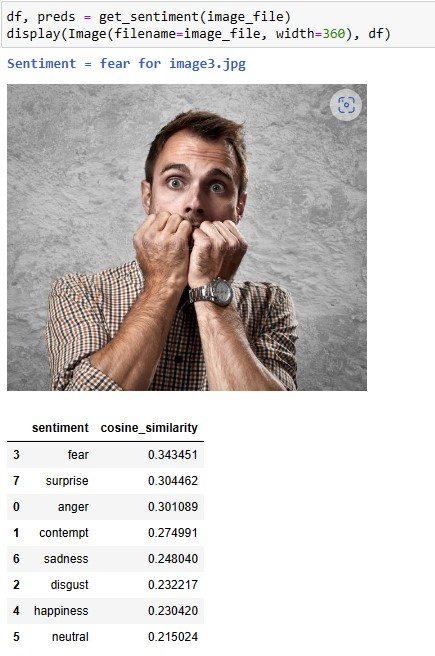
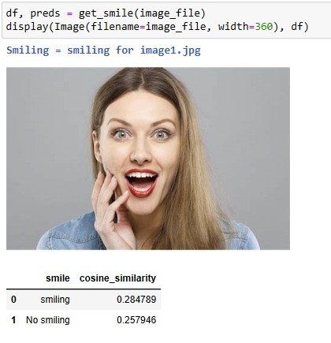
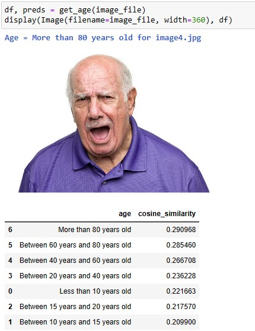

# Face Analytics using vectors embeddings with Azure Computer Vision 4 (Florence)

The Azure Computer Vision Image Analysis service 4.0 can extract a wide variety of visual features from your images. 
We have some image vector embeddings and text vector embeddings that we can use.
Cosine similarity about these embeddings can predict some attributes.

Note: This feature is public preview at the moment.

## Demo notebook
<a href="https://github.com/retkowsky/Face_Analytics_Azure_Computer_Vision_Florence/blob/main/Face%20Analysis%20with%20Azure%20Computer%20Vision%204.ipynb">Python demo notebook</a>

## Screenshots

## Documentation
https://learn.microsoft.com/en-us/azure/cognitive-services/computer-vision/
 
13-Apr-2023 Serge Retkowsky | serge.retkowsky@microsoft.com | https://www.linkedin.com/in/serger/
